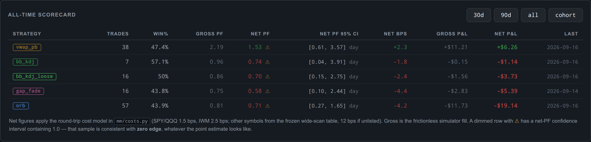
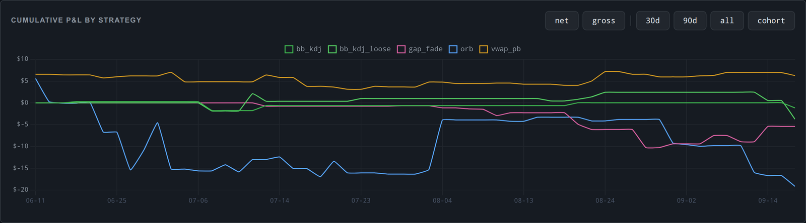

<h1 align="center">moomoo-trader</h1>

<p align="center">
  <strong>A paper-only intraday strategy lab that measures itself honestly.</strong><br>
  Five strategies trade Moomoo's simulated account on 5-minute bars, while a research pipeline<br>
  keeps asking the only question that matters: does any of it survive transaction costs?
</p>

<p align="center">
  
  
  
  
  
</p>

<p align="center">
  <a href="#the-interesting-part">The finding</a> •
  <a href="#whats-actually-verified">Status</a> •
  <a href="#how-it-works">How it works</a> •
  <a href="#how-the-research-is-kept-honest">Method</a> •
  <a href="#quick-start">Quick start</a> •
  <a href="docs/PLAN.md">PLAN.md</a>
</p>

---

> [!NOTE]
> **A personal research project, not a trading product or advice.** It runs on a small VPS
> against Moomoo's paper account and has never placed a real order. The code and docs were written
> with [Claude Code](https://claude.com/claude-code), with periodic independent reviews by Codex. I
> directed the work, ran it, and made the calls.

> [!CAUTION]
> **There is no demonstrated edge here.** Net of modeled trading costs, the live paper results are
> negative, and every strategy's confidence interval still includes "no edge at all." Read the
> results below as a measurement, not a pitch.

## The interesting part

For months the dashboard reported a profit. Then the same live trades were re-measured with a
transaction-cost model:

| Same 102 live paper trades | Total P&L | Profit factor | 95% CI (PF) | P(mean > 0) |
|---|---:|---:|---|---:|
| **Gross** (frictionless fills) | +$12.92 | 1.19 | 0.66 – 2.17 | 0.72 |
| **Net** of modeled costs (1.5–2.5 bps) | **−$0.57** | **0.99** | 0.55 – 1.78 | 0.48 |

**The apparent profit disappeared under the modeled costs.** Since then every report, gate, and
backtest in the repo shows gross and net side by side, and the decision gates are read net. The
trades logged since that re-measurement have been worse, not better; see the
[latest health review](docs/strategy_graveyard.md).

The project's value is the machinery that found this, and keeps finding things: an order layer
that booked fills that never happened, a price archive with silent splice seams, test fixtures
leaking into research data, a live filter that was configured on but never wired in. All of these
are written up in the [graveyard](docs/strategy_graveyard.md), including the ones I got wrong the
first time.

---

## What it looks like

<p align="center">
  
</p>

<p align="center">
  
</p>

<p align="center"><sub>The live web dashboard (Flask, behind nginx). The ⚠ marks a net-PF interval that contains 1.0.</sub></p>

---

## What's actually verified

What has been run and checked, versus what merely exists.

| | Area | Notes |
|---|---|---|
| ✅ | **Paper runner, 24/5 on a VPS** | Five strategies × SPY/QQQ/IWM. Confirmed fills, broker reconciliation, persisted positions, kill switches. Running since June. |
| ✅ | **One canonical ruler** | `mm/trades.py` pairs every trade and `mm/costs.py` prices it. The dashboard, EOD report, and analysis script are tested to agree. |
| ✅ | **Replay of the real code path** | `mm/replay.py` drives the live runner bar by bar against a fake broker. |
| ✅ | **Fast engines match the real runner** | Four fast backtest engines reproduce the replay **exactly** (trade counts and net PF) on Jan–Jun 2026. The preregistered first attempt *failed* and is recorded as such; the cause was a replay fill model and a live bug, both fixed. |
| ✅ | **Archive integrity** | Forward-adjusted price files are rebased, never spliced, when a dividend or split changes history. The real archives are checked for fixture rows and impossible jumps. |
| ✅ | **Test suite** | pytest covers risk, signals, engines, replay, costs, statistics, archives, and bulk-fetch quota safety. A session guard fails the run if any test touches the real `logs/`. |
| 🚧 | **LLM regime gate** | Claude classifies the morning regime and blocks two mean-reversion lanes on trending days. It is live and gating, but its value has **not** been shown against a no-gate baseline. |
| 🚧 | **Wide scan (85 symbols)** | Universe, costs, parameters, split, and selection rule are frozen in advance; the data pull and scan are in progress. No results yet. |
| 🚧 | **Forward cohort** | A frozen live configuration from 2026-09-17 is the only clean test of the live settings. It is too young to say anything. |
| ❌ | **A profitable strategy** | Not demonstrated. See above. |
| ❌ | **Live (real-money) trading** | Deliberately not built. `live_trade_runner.py.DISABLED` is never executed. |

---

## How it works

```
                 ┌────────────────────────────────────────────────┐
  OpenD ────────>│  Paper runner  (mm/paper.py, polls every 60 s) │
  127.0.0.1      │                                                │
  :11111         │   5-min candles per symbol                     │
                 │     │                                          │
                 │     ├─ bb_kdj        <── LLM regime gate       │
                 │     ├─ bb_kdj_loose  <── (morning, Claude)     │
                 │     ├─ orb           <── VIX cap, 12:30 cutoff │
                 │     ├─ vwap_pb                                 │
                 │     └─ gap_fade      <── VIX cap, large-gap    │
                 │                          short filter          │
                 │   risk checks → SIMULATE order → confirm fill  │
                 │   positions on disk · JSONL event log          │
                 └───────────────────────┬────────────────────────┘
                                         │
           ┌─────────────────────────────┼──────────────────────────┐
           ▼                             ▼                          ▼
   Discord alerts             mm/trades.py + mm/costs.py      Web dashboard
   (entries, exits, EOD)      one pairing, one cost model     (gross + net)
                                         │
                                         ▼
               analyze_trades.py · replay · fast engines · wide scan
```

<details>
<summary><b>The five live strategies</b></summary>

<br>

All run on SPY, QQQ, and IWM with 5-minute closed bars. Per-symbol overrides and the exact live
values are in [`docs/frozen_config_2026-09-17.env`](docs/frozen_config_2026-09-17.env); full specs
are in [`docs/ARCHITECTURE.md`](docs/ARCHITECTURE.md).

| Strategy | Idea | Entry | Exit |
|---|---|---|---|
| `bb_kdj` | Mean reversion | Close ≤ lower Bollinger band, KDJ golden cross, ≥ 2 bonus signals, ranging regime | Back to the BB middle, or 1 × ATR stop |
| `bb_kdj_loose` | Measurement lane | Same signal with no bonus or regime gate, to measure what the gates are worth | Same |
| `orb` | Opening-range breakout | Close beyond the 15-min range (30-min for IWM) with a volume surge; no entries after 12:30 ET; shorts on SPY only | 1.5 × range target, the far side of the range, or 15:45 |
| `vwap_pb` | VWAP flush-and-reclaim | Wick below VWAP that closes above it, on a quiet bar, in a session that hasn't chopped | Close back below VWAP, ATR stop, or 15:45 |
| `gap_fade` | Opening-gap fade | 9:35 bar rejects a 0.3–2 % gap; gap-up shorts above 1 % are skipped | Half the gap filled, a stop beyond the first bar, or 11:00 |

</details>

---

## How the research is kept honest

The failure mode this project is built against is quietly retuning until a backtest looks good.

| Rule | Where it lives |
|---|---|
| **Gates are written before the data.** Each strategy has sample-size gates and actions, and changing one needs a dated amendment. | [`docs/evaluation_criteria.md`](docs/evaluation_criteria.md) |
| **Net is the ruler.** Every PF threshold means net PF under a frozen, deliberately non-tunable cost model. | [`mm/costs.py`](mm/costs.py) |
| **Uncertainty is bootstrapped by trading day**, because same-day trades across symbols are not independent. | [`mm/stats.py`](mm/stats.py) |
| **Two engines must agree** before the fast one is trusted for a scan, with a tolerance fixed in advance. | [`scripts/cross_validate_engines.py`](scripts/cross_validate_engines.py) |
| **A sealed holdout.** 2019–2021 was never touched by any research; the scan script refuses to compute it until the finalist list is committed. | [`scripts/wide_scan.py`](scripts/wide_scan.py) |
| **Nothing is deleted.** Every dead idea, bug, and wrong claim stays on record with its data. | [`docs/strategy_graveyard.md`](docs/strategy_graveyard.md) |

> [!IMPORTANT]
> **A null result is an acceptable outcome.** Retail intraday mean reversion on the most liquid US
> ETFs is one of the most competed trades there is. If the wide scan finds nothing, that is
> recorded as a finding, not rescued by relaxing a threshold.

---

## Quick start

> [!WARNING]
> Needs a [Moomoo](https://www.moomoo.com) account and
> [OpenD](https://openapi.moomoo.com/moomoo-api-doc/) running at `127.0.0.1:11111`. Moomoo's
> history API allows **100 distinct symbols per 30 days**; the bulk fetch refuses to overspend it.

```bash
git clone https://github.com/flyboy-byte/moomoo-trader.git
cd moomoo-trader
python -m venv .venv && source .venv/bin/activate
pip install -r requirements.txt

cp .env.example .env        # TRD_ENV=SIMULATE stays; see below for live values
python scripts/health_check.py            # is OpenD reachable?
python scripts/fetch_candles.py --symbol US.SPY --start 2024-01-01
python scripts/replay_paper.py --latest   # real runner, fake broker
./start.sh                                # paper runner
python scripts/web_dashboard.py           # http://localhost:8080
```

`.env.example` documents every setting with safe defaults. The settings the VPS actually runs are
in [`docs/frozen_config_2026-09-17.env`](docs/frozen_config_2026-09-17.env).

<details>
<summary><b>Research commands</b></summary>

<br>

```bash
python scripts/analyze_trades.py --all          # per-strategy gross/net, CIs, benchmark
python scripts/cross_validate_engines.py --fast-only   # fast engines, frozen config
python scripts/replay_paper.py --latest --fill close   # replay at signal-close fills
python scripts/fetch_universe.py --dry-run      # quota + plan for the wide-scan pull
python scripts/wide_scan.py dev --workers 10    # development window (after the pull)
python scripts/wide_scan.py holdout             # refuses until finalists are committed
./scripts/verify.sh                             # tests + log sync + diagnostics
```

</details>

---

## Safety

- `TRD_ENV=SIMULATE`: every order goes to Moomoo's paper account.
- `LIVE_TRADING_ENABLED=false` is checked in code before every order attempt.
- `touch STOP_TRADING.txt` pauses the runner without killing it.
- Positions persist to disk and are reconciled against the broker, so a restart mid-session is safe.
- No secrets in the repo: configuration lives in a gitignored `.env`.

---

## Where things are

| Doc | For |
|---|---|
| [`docs/PLAN.md`](docs/PLAN.md) | The single active plan: ordered steps, each with a "done when" |
| [`docs/strategy_graveyard.md`](docs/strategy_graveyard.md) | Every finding, bug, and dead end, with data |
| [`docs/evaluation_criteria.md`](docs/evaluation_criteria.md) | Preregistered gates, the cohort, and the wide-scan rules |
| [`docs/ARCHITECTURE.md`](docs/ARCHITECTURE.md) | Data flow, strategy specs, config reference, kill switches |
| [`docs/PROJECT_MAP.md`](docs/PROJECT_MAP.md) | File-by-file map |
| [`docs/research-reset.md`](docs/research-reset.md) | The evidence behind the gross→net finding |

<details>
<summary><b>Repo layout</b></summary>

<br>

```
mm/                   core package
  config.py           .env → typed config singleton
  paper.py            the live loop        evals.py      per-strategy live logic
  execution.py        orders + fills       risk.py       sizing, limits, kill switch
  events.py           JSONL log, positions clock.py      time seam for tests/replay
  trades.py           canonical pairing    costs.py      frozen cost model
  stats.py            day-block bootstrap  scan.py       wide-scan rules and engines
  backtest.py         BB+KDJ engine, canonical profit_factor()
  orb_strategy.py · vwap_pullback.py · gap_fade.py · ema_momentum.py   fast engines
  replay.py           real runner + fake broker
  data.py             candle fetch, basis-safe archive merge
  bulk_fetch.py       quota-safe universe pull
  morning_regime.py   LLM regime classifier    vol_engine.py   volatility shadow log
scripts/              CLI entry points (backtests, replay, analysis, dashboard, cron)
tests/                pytest suite + a guard that the real logs/ is never touched
docs/                 plan, graveyard, criteria, architecture, frozen configs
```

</details>

## Tests

```bash
python -m pytest tests/ -q
```

Some tests read the local candle archives in `logs/` and skip when they aren't there.

## License

[MIT](LICENSE)
